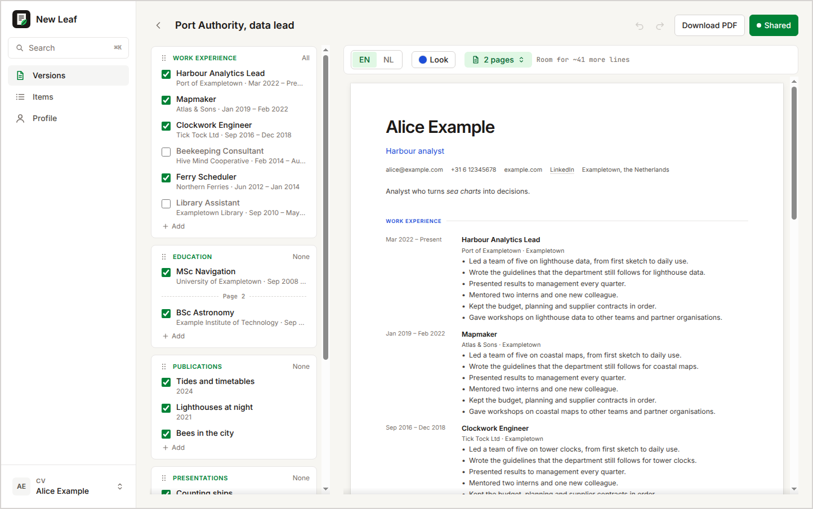
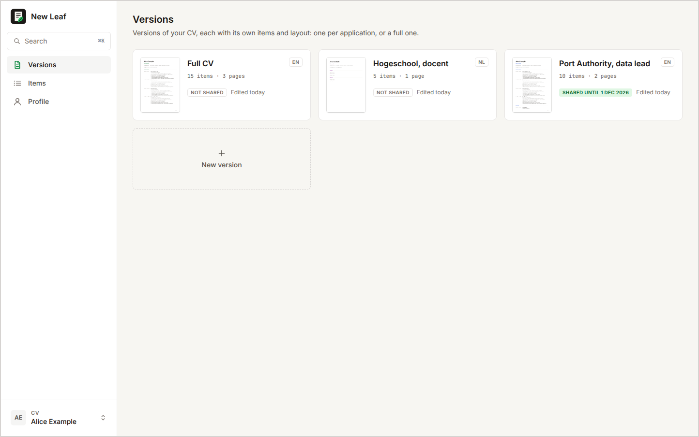
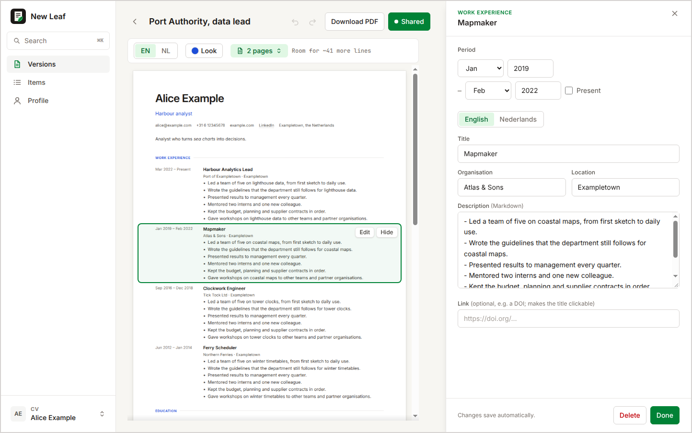
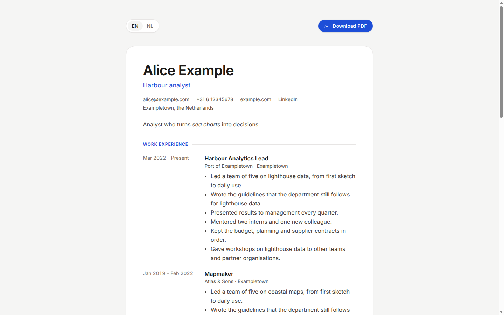
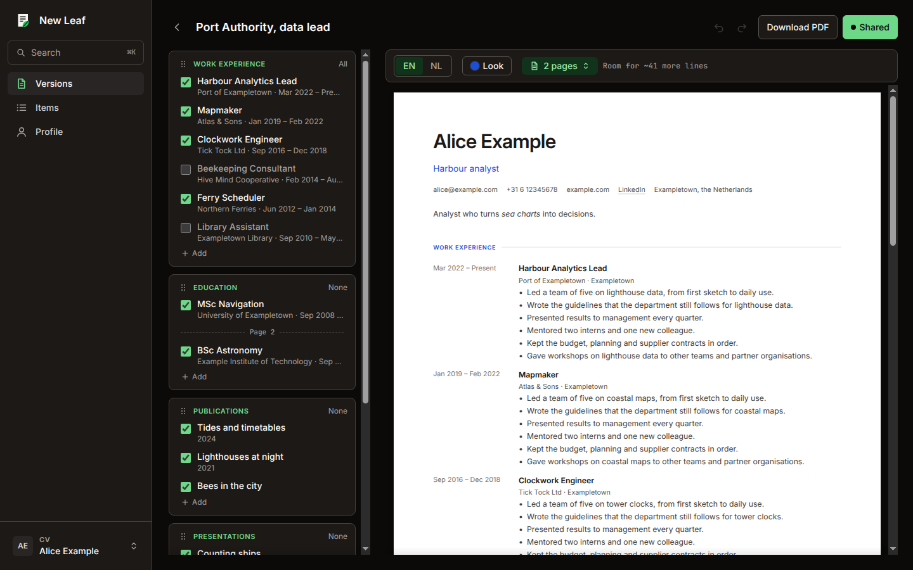

# New Leaf

**Keep one CV, and turn over a new leaf for every application.**

A CV editor for your own computer, or on a server for everyone on your
Tailscale network. Your CV is a folder of Markdown files, and every
application gets a version of it with its own items, order, language and
look, with the PDF right next to it. See [Getting started](#2-getting-started).

<br/>

[](https://github.com/jorritvanderheide/new-leaf/actions/workflows/ci.yml)
[](https://github.com/jorritvanderheide/new-leaf/releases)

[](LICENSE)



You have one CV, and every application wants a slightly different one. The
PhD position wants your publications first, the consultancy wants two pages
and no teaching, the Dutch employer wants it in Dutch. So you copy the file,
cut, reorder, translate, and nudge the spacing until it fits. A month later
you have six copies, each with a different version of the job you changed in
the meantime, and you no longer know which one you sent where.

New Leaf keeps everything you have done once, as items in one language or two.
For each application you make a *version*: you tick the items it shows, drag
the sections into the order that suits it, and pick its language and look.
The PDF is there next to it as you work, with its page count and how much is
left before the next page. Click anything in the PDF to change it, and every
version that shows it is up to date at once. When you want to send it, you
download the PDF, or share a link to a page with it in each of your languages.

<br/>

## 1 Installation

**On your own computer**, download the archive for your system from the
[releases](https://github.com/jorritvanderheide/new-leaf/releases), unpack it
and run `new-leaf` (`new-leaf.exe` on Windows). Everything it needs is in the
archive. The programs are not signed: on macOS, right-click `new-leaf` and
choose Open the first time; on Windows, choose *More info* and *Run anyway*.

With Nix, the flake lives in this repository:

```sh
nix run git+https://codeberg.org/BW20/new-leaf             # try it
nix profile install git+https://codeberg.org/BW20/new-leaf  # "New Leaf" in your app launcher
```

**On a server**, for yourself and others on a [Tailscale](https://tailscale.com)
network, with share links: see [Self-hosting](docs/self-hosting.md). The NixOS
module serves it in one of two ways: with
[Tailscale only](docs/self-hosting.md#tailscale-only), with no domain, web
server or open port, or with nginx on
[your own domains](docs/self-hosting.md#your-own-domains). There is a Docker
setup too.

<br/>

## 2 Getting started

Start New Leaf. It opens in your browser, and keeps running until you choose
**Quit** in the menu at the bottom of the sidebar, or a few minutes after you
close the tab. Then:

1. **Fill in your profile.** Your name, contact details and a short summary.
   Your CV starts in English: under **Languages**, pick another main language
   or add a second one. Add a photo if you want one.
2. **Add your items.** Jobs, education, publications, teaching, anything that
   could go on a CV, each once. Dates are a month and a year, or a year.
3. **Open the Full CV.** It's the first version, with every item. Tick items
   off, drag sections around, and watch the PDF next to it.
4. **Make a version for an application.** **New version** on the Versions
   page, from all items or as a copy of another one. Pick how many pages it
   should fit on, and New Leaf sets the spacing to fill them.
5. **Send it.** **Download PDF**. On a server you can also **Share** it, as a
   link to a web page with the PDF, in each of your languages.

Changes save as you go. ⌘K (Ctrl+K) finds any item, page or version.

<br/>

## 3 Safety and quality

On your own computer, New Leaf only answers on `localhost`, never on your
network, and it never connects to the internet. Your CV is a folder of plain
Markdown files that you can read, back up and keep in version control without
New Leaf. [Section 10](#10-network-and-file-disclosure) lists exactly what it
reads and writes.

Text you type is never run as code: the PDF template gets your CV as data,
not as markup. A share link only ever contains the items of its version;
the others don't reach the public web server at all.

Every push is tested: Go tests that make real PDFs, browser tests that click
through the editor in light and dark, check text contrast and use a made-up
CV, and a test that runs the NixOS module in a virtual machine. Releases are
built in the open with a signed attestation, so you can check that the file you
downloaded is the one that was built. [Section 10.4](#104-how-releases-are-built)
says how.

<br/>

## Table of contents

- [4 Documentation](#4-documentation)
- [5 Features](#5-features)
- [6 Versions](#6-versions)
- [7 Share links](#7-share-links)
- [8 Keyboard](#8-keyboard)
- [9 Options](#9-options)
- [10 Network and file disclosure](#10-network-and-file-disclosure)
- [11 Questions or issues?](#11-questions-or-issues)
- [12 Support](#12-support)
- [13 License](#13-license)

<br/>

## 4 Documentation

If you want to host New Leaf, work on it, or build something on top of its
files:

- [**Self-hosting**](docs/self-hosting.md) - The NixOS module, the Docker setup,
  how sign-in over Tailscale works, and what the reverse proxy needs to do.
- [**Data model**](docs/data-model.md) - Every file New Leaf keeps, what is in
  it, and how a CV is laid out.
- [**Compatibility**](docs/compatibility.md) - What a release may change: files,
  options, share links. Changes are in [CHANGELOG.md](CHANGELOG.md).
- [**PDF**](docs/pdf.md) - The Typst template, the data it gets, and how the
  preview knows where each item is.
- [**Architecture**](docs/architecture.md) - How the code is laid out, and how a
  CV becomes a PDF, a share page and a thumbnail.
- [**Development**](docs/development.md) - Setup, tests, checks and releases.

<br/>

## 5 Features

### 5.1 Items, once

Everything you have done is an item: a job, a degree, a paper, a talk, a
course you taught. Each has a period or a date, an organisation and a place,
and a description in Markdown.

A CV is in one language or two, chosen on the Profile page: English, Dutch,
German, French, Spanish, Italian or Portuguese. With two, each item has text
in both; a warning shows where one is still missing, and **Start from
English** (or the other language) fills it in for you to translate.

Publications are written as their reference, the way your field cites them,
with the DOI as a link. Undated ones, like a paper under review, go last.

### 5.2 Versions



A version is your CV for one application: its own items, section order,
language and look. The Versions page shows the first page of each, how long it
is and whether it is shared. Make a new one from all items or as a copy, and
delete one with an undo. See [Versions](#6-versions).

### 5.3 The preview



The PDF is drawn next to your items as you change them. Hover over an item in
it and click to edit it, or hide it from this version. The item list shows
where each page starts, and the page count says how many lines you are over,
or how much room is left. **Fit on** sets the spacing as generous as still fits
on the number of pages you pick.

### 5.4 Looks

Each version has a look: an accent colour, a sans-serif or serif typeface,
the shape of your photo, and the spacing. New Leaf warns when a colour is too
pale to read as text, and offers a darker shade of it. **Use look and section
order for new versions** makes it the starting point for the next one.

### 5.5 Share links



On a server, a version can be shared as a web page with its PDF, in each of
your languages, until a date you choose or for as long as you like. See
[Share links](#7-share-links).

### 5.6 Light and dark



New Leaf follows your system's light or dark mode, or the one you choose in
the menu at the bottom of the sidebar. The PDF stays white, like paper.

### 5.7 More than one CV

The menu at the bottom of the sidebar switches between CVs: yours and your
partner's, say. **Manage CVs** creates, renames and deletes them. On a server,
every CV opens by default for the people it belongs to.

### 5.8 Backups

**Download backup** on the Profile page saves a CV, with its versions, as one
zip file. **Restore** brings it back, on the same computer or another one, or
on a server; what it replaces is kept as a backup first.

<br/>

## 6 Versions

### 6.1 What a version holds

Items and your profile are shared by all versions: fix a typo once and it is
fixed everywhere. A version only holds choices:

- **Which items** it shows. A new item joins the versions that show every
  item, like the Full CV, and not the ones you tailored.
- **The order of the sections**, by dragging them, or with Alt+↑/↓ on the
  handle. Within a section, items are always newest first.
- **The language**, if your CV has two.
- **The look**: colour, typeface, photo shape, spacing.
- **How many pages** it should fit on.

Undo (⌘Z) and redo (⇧⌘Z) go back and forth through these choices.

### 6.2 Fitting the pages

The page count turns amber when the version is longer than the pages it
should fit on. Click it and pick a number: New Leaf tries the spacings from
generous to tight and keeps the most generous one that fits. If even the
tightest doesn't, it says so, and the dividers in the item list show what is on
the last page.

### 6.3 Missing translations

A version in your second language shows a warning next to the items that have
no text in it yet, and the header counts them. Click one to fill it in.

<br/>

## 7 Share links

Share links are for running New Leaf on a server, see
[Self-hosting](docs/self-hosting.md).

- **Share** publishes a version as a web page at an address like
  `https://cv.example.com/uva-k7f3q9ab/`. The random part means nobody finds it
  by guessing.
- The page has the version in each of your languages, with a switch, and each
  language has its PDF. It opens in the language of the version.
- The link **follows the version**: change an item, its order or its look, and
  the page is updated within seconds.
- It works **until a date** you choose, or until you stop sharing. Stopping
  takes it offline at once. Sharing again gives a new address.
- Only the items of that version reach the web server. Pages ask search
  engines not to index them.

<br/>

## 8 Keyboard

| Keys | What it does |
| --- | --- |
| ⌘K, Ctrl+K | Find an item, page, version or CV |
| ⌘S, Ctrl+S | Save now |
| ⌘Z, Ctrl+Z | Undo a change to a version |
| ⇧⌘Z, Ctrl+Shift+Z | Redo |
| Alt+↑, Alt+↓ | Move a section, on its handle |
| Escape | Close the item editor or a dialog |

<br/>

## 9 Options

`new-leaf -h` lists them. The ones you may want:

| Option | Default | What it does |
| --- | --- | --- |
| `-data` | `~/.local/share/new-leaf` (Linux), the app data folder elsewhere | Where your CVs are kept |
| `-listen` | `127.0.0.1:8484` | Where the editor answers; another free port if this one is taken |
| `-no-browser` | off | Don't open the editor in the browser |
| `-idle` | `5m` | Stop this long after the last editor was closed; `0` never stops |
| `-typst` | next to `new-leaf`, or on the `PATH` | The Typst program that makes the PDFs |
| `-version` | | Print the version |

Every option can also be set in the environment: `NEW_LEAF_DATA` for `-data`,
and so on. The server has its own options: `new-leaf serve -h`, and
[Self-hosting](docs/self-hosting.md).

<br/>

## 10 Network and file disclosure

### 10.1 On your own computer

- **Listening:** on `127.0.0.1:8484`, or another free port, for your browser
  only. Requests that don't name `localhost` or `127.0.0.1` are refused, so
  websites can't reach it either.
- **Connections:** none. New Leaf doesn't connect to the internet, check for
  updates or send anything anywhere.
- **Programs:** Typst, to make PDFs and thumbnails, with your CV as data. It
  runs in a temporary folder and can't read files outside it.
- **Your browser** is opened once, at start, unless `-no-browser`.

### 10.2 Files it writes

- **Your CVs:** in the data folder. One Markdown file per item and language,
  your profile, your photo, one file per version, and the backups made before
  a restore. See [Data model](docs/data-model.md).
- **Deleted CVs:** moved to `trash/` in the data folder, never removed.
- **Cache:** the fonts for Typst and the thumbnails, in your cache folder
  (`~/.cache/new-leaf` on Linux). Safe to delete.
- **Your browser** remembers light or dark mode, and which CV you had open.

### 10.3 On a server

Sign-in, share links and what the server writes are described in
[Self-hosting](docs/self-hosting.md). In short: the editor asks Tailscale who a
visitor is, and share links are static files in a folder that a web server
publishes.

### 10.4 How releases are built

Every push is built and tested by GitHub Actions: `go vet` and the Go tests,
with Typst; a check that the stylesheets match the templates; the browser tests
in Chrome; and `nix flake check`, which builds the package and the container
image and runs the NixOS module in a virtual machine.

Releases are built by GitHub Actions from the tagged source, with every action
pinned to an exact version. Typst comes from its own releases, checked
against pinned checksums. The archives and the container image come with a
signed build provenance attestation, so you can check that what you downloaded
is what was built:

```sh
gh attestation verify new-leaf-0.5.0-linux-amd64.tar.gz --repo jorritvanderheide/new-leaf
gh attestation verify oci://ghcr.io/jorritvanderheide/new-leaf:0.5.0 --repo jorritvanderheide/new-leaf
```

<br/>

## 11 Questions or issues?

Have a look at the [FAQ](FAQ.md) first: it covers the most common surprises,
like Typst not being found or a warning when you first open the app. If
something still doesn't work, or you have an idea, please
[open an issue](https://codeberg.org/BW20/new-leaf/issues/new/choose).
Found a security problem? Please report it privately, as described in the
[security policy](SECURITY.md).

The source and the issues live on [Codeberg](https://codeberg.org/BW20/new-leaf).
The source is mirrored to [GitHub](https://github.com/jorritvanderheide/new-leaf),
where the releases are built.

<br/>

## 12 Support

New Leaf is free. If you find it useful, you can support its development on
Liberapay:

[](https://liberapay.com/BW20)

<br/>

## 13 License

Copyright © 2026 Jorrit van der Heide. Licensed under the [EUPL-1.2](LICENSE).

Bundled: Alpine.js (MIT), pdf.js (Apache-2.0), and the Inter, Source Serif 4 and
JetBrains Mono typefaces (SIL Open Font License 1.1), each with its licence next
to it under `web/`. The release archives and the container image include
[Typst](https://github.com/typst/typst) (Apache-2.0), with its licence in the
archives.
