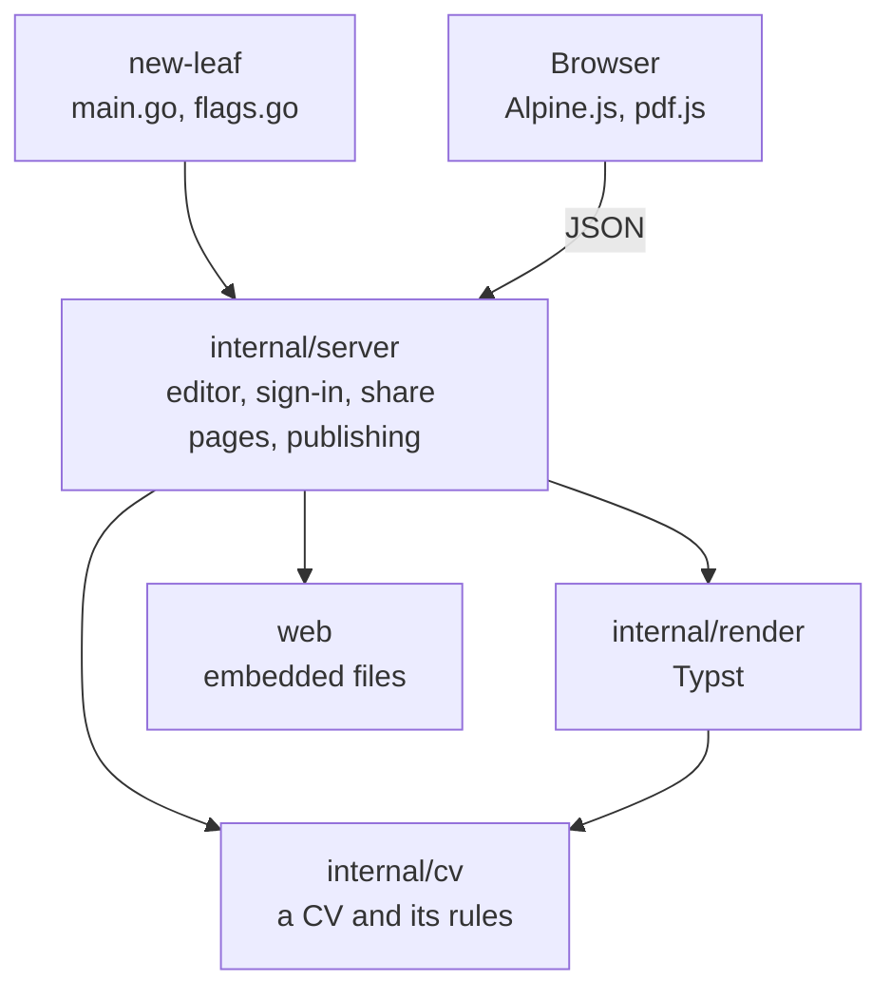

# Architecture

New Leaf is one Go program with its web pages, styles, PDF template and fonts
embedded, plus Typst to make PDFs. The same program is the editor on your own
computer (`new-leaf`) and on a server (`new-leaf serve`); the server adds
sign-in, more CVs and share links.

## Where state lives

- **The files are the record.** A CV is a folder of Markdown and JSON (see
  [Data model](data-model.md)). The server reads them on every request and
  keeps no copy of its own, so editing a file by hand, or restoring a backup,
  takes effect at once.
- **Everything else can be made again.** PDFs and previews are rendered on
  request. Thumbnails and Typst's fonts are in the work folder. Share links
  are published from the files, and published again whenever the app starts.
- **The browser** keeps only light or dark mode, and which CV is open.

## Layers

The command reads flags; three packages under `internal/` do the work, each
only importing the ones below it, which the compiler enforces.

| Path | What it holds |
| --- | --- |
| `main.go`, `flags.go` | The command: flags (also from `NEW_LEAF_*`), `-version`, finding Typst, the data folder, moving cv-app's data |
| **`internal/cv`** | **A CV and its rules: files, no HTTP, no Typst** |
| `store.go`, `profile.go`, `items.go`, `links.go` | Reading and writing the profile, items and share links, the helpers for their files, and moving a CV from an older format over |
| `versions.go` | Versions, and the first ones for CVs from before them |
| `cvs.go` | Which CVs exist; making, renaming and deleting them |
| `backup.go` | Backups: writing one, checking one fully, restoring it |
| `jsonresume.go` | JSON Resume: a CV out as one, and one in as a CV, staged like a backup |
| `languages.go` | The languages a CV can be in, with the words New Leaf adds to its PDF and share page |
| `theme.go` | Looks: accent colour, font, photo shape |
| `document.go` | A CV for one version and language: sorted, localised, Markdown parsed |
| **`internal/render`** | **Running Typst for PDFs, PNGs and marks** |
| **`internal/server`** | **The editor and everything around it** |
| `serve.go`, `local.go` | `new-leaf serve` (listeners, the public folder's own server, expiring links) and `new-leaf` on your own computer (a free port, the browser, stopping when idle) |
| `server.go`, `state.go` | Routes, the editor's security headers, errors, and the state the editor gets after each change |
| `health.go` | `/healthz`, for monitoring |
| `profile.go`, `items.go`, `versions.go`, `cvs.go`, `backup.go` | The API, by topic |
| `preview.go`, `document.go` | PDFs, fitting pages and marks for the preview |
| `auth.go` | Who a visitor is (`tailscale whois`), and which CV opens for them |
| `share.go`, `publish.go` | Share pages, from the same `Document` as the PDF; writing them into the public folder, and removing what isn't a link |
| `thumbs.go` | The overview's thumbnails, rendered in the background |
| `assets.go` | The editor's pages and icons, from `web` or from disk while developing |
| `web/` | The embedded files (`embed.go`): `editor/` (Go templates, `app.js`, `mode.js`, `editor.css`), `share/` (the share page and its fonts), `typst/` (`cv.typ` and its fonts); and `css/`, the Tailwind inputs for the two stylesheets, which are generated and committed |
| `nix/` | The package, the NixOS module, its VM test, the container image |
| `tests/browser/` | Browser tests in headless Chromium, against a made-up CV |
| `scripts/` | Release archives with Typst, and Typst's pinned checksums |
| `deploy/` | The Docker Compose recipe |

## A change, from click to PDF

1. The editor sends the change as JSON, with an `X-New-Leaf` header. A
   browser only sends that header from the editor's own pages, so other
   websites can't make changes.
2. `authenticate` finds the visitor and their CV (on your own computer,
   `localOnly` refuses requests not addressed to `localhost`).
3. The handler validates and writes the files, one change per CV at a time,
   and answers with the CV's whole state, which the editor takes as it is.
4. If a version with a share link changed, its pages and PDFs are published
   again in the background. Changes made while that runs are published
   together, right after.
5. The editor asks for the PDF and the marks of the open version
   (`/api/pdf`, `/api/layout`) and draws them. See [PDF](pdf.md).

## Rules

**A CV's rules live in `internal/cv`.** What a CV may hold, how its files are
laid out and how it changes belongs there; the server only turns requests
into calls and answers. `internal/cv` imports neither HTTP nor Typst, so its
rules can be tested with plain files.

**User text is never markup.** Typst gets runs of text, not Typst, and the
share pages go through `html/template`. A CV can't run code anywhere it is
shown.

**The share page and the PDF come from one `Document`.** Anything that changes
what a CV shows belongs in `internal/cv/document.go`, not in a template.

**Items that a version doesn't show never reach the public folder.** A share
link is published from the version's selection, not filtered on the page.

**The public folder holds only links.** `reconcile` removes anything else,
which is how expired links go offline. It only manages a folder that is empty
or carries its `.new-leaf-public` marker.

**No build step for the browser.** `app.js` and the vendored Alpine.js and
pdf.js are served as they are. Only the CSS is generated, by Tailwind, and
committed, so `go build` alone makes a working program.
